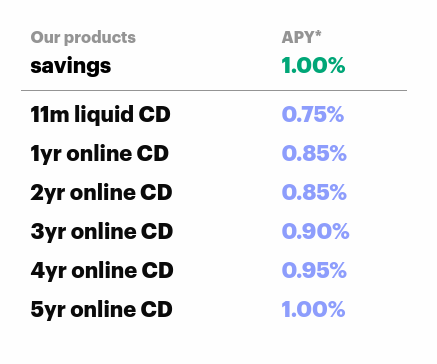
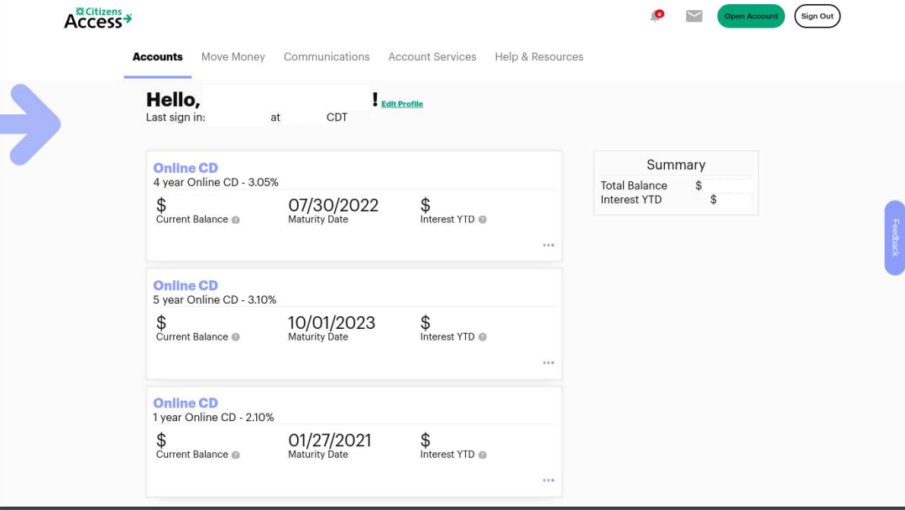

The rates have really dropped but this is where the market is at. I was able to open a 1yr online CD at 2.10% at the beginning of this year before the rate fell to 0.85%. See my dash below. Recently, I opened another high-rate product yielding 4.00% on my balance of $3000 ( 1.00% on balances > $3000). This one is actually a checking and savings account and while it comes with a debit card, I don't use it to transact. * I use the account kind of like a CD, a place to park 3 grand and after a year, my business with the bank, aka my balance will earn $120. The accounts in the dash below yield more than that every single month. I make a couple thousand on interest alone but I would like these safer investments to come right up to five figures in interest alone each year. It totally depends on the economy and the rates of these products, so that's the thing. This may be my best year, or during this year and after 2021, 2022, or 2023, when my investments mature, new products might be introduced to the market which are better. I think I'm doing this right, but something tells me there is even more money to be made on interest. In fact, don't get me started..

*In an upcoming post, I am going to write about my credit, how I use it, about which cards I'm currently into, what's serving me. Yes, I have spreadsheets on all of this.

Here is a glimpse of my accounts at Citizen's Access. You can see the 4yr and the 5yr rates were 3.05% and 3.10% at the time of opening. You can see the date these are released back to the wild, annotated "maturity date." After that it will be up to me to find other investments, or who knows maybe I will buy a multi-unit place or condos or something. This is a really special time because I will probably never have sleeping, dormant money like this ever again. I think born here, is an idea for another post: where am I going to be on 1/27/2021? 7/30/2022? 10/01/2023? What will my purchasing power be?

Right now, I can tell you it's not very much. More later.. -AUR
