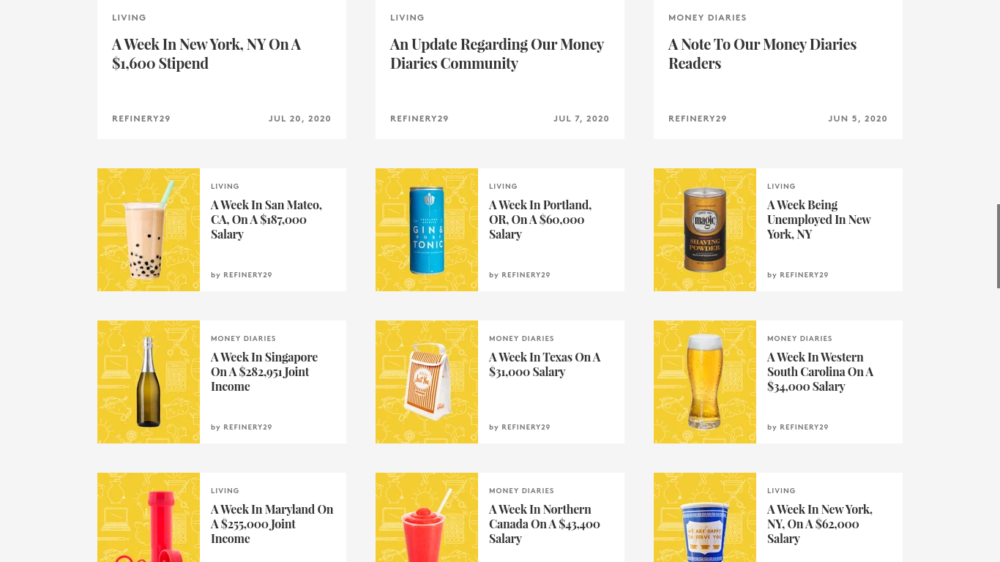

Finally.

Occupation: Uhhhhh 
Industry: uhhhhh
Age: 29.5

Location: Austin

Salary: Ummm

Net Worth: Not sure, but I feel pretty worthless.

Debt: I don't have debt but I may have medical bills in collection. No te preoccupes, my credit score is nearly perfect.

Paycheck Amount: N/A

Pronouns: She/her/hers

Monthly Expenses
Rent: I don't pay rent, but I work on the property where I live, where I did a landscape redesign and add value by working on the garden, xeriscaping, cultivating fruit trees and flowers, and developing the property as much as I can. $0

Utilities: I don't pay utilities, but I implement strategies to save on utilities and I'm pretty dedicated to being energy-efficient and conservative. $0

Internet: I don't pay internet. $0

Savings: For the last few months, I've been saving about $4k a month. Normally, I don't. 

Mobile: I don't pay for my cell phone but my sister asked me to contribute. About a week ago, I told her I would chip in but I haven't paid anything yet. $0

Streaming Services: Currently using a free trial of HBO which I'm cancelling before the first bill. $0, share Netflix with the homies and get Kanopy through my public library...I have a Spotify Premium through a family plan...unsure who pays it. I don't have Amazon or Prime...I'm very anti-Amazon, I don't use it at all and never have. $0

Student Loans: I had less than $20K in students loans which were discharged due to permanent disability. $0

Health Insurance: I have private insurance but I don't pay for it. $0

Car Insurance: It's lumped in with my parents who cover my siblings and I. $0

Gym: $0. If I want to use machines, I use a key my brother gave me to the fitness center of his old apartments. He no longer lives there but the key still works...it's not electric. It's 10 minutes away by car so I never go there. My boyfriend's little sister has weights in the garage where we live. She lives part of the year in the US and part of the year in Mexico. When she leaves, this week actually, I'll probably start using them. Otherwise I work out outside or indoors on my opalescent Manduka PROlite purchased back in 2016. I actually own my own weights, I believe they belong to my OTHER brother, but they are at my parents house. I started doing free YouTube workouts...Really loving YouTube, except for all the bad parts about it..$0

Retirement: I'm opening a Roth IRA this week but I haven't made any contributions to it. $0

Day One.

1am - Stayed up late reading "How to Do Nothing: Resisting the Attention Economy," by Jenny Odell on my Libby app, which I get access to through my public library card. Love this book so far. I have a couple others on "My Shelf" -- a feature of the app showing other loans I currently have checked out from the library.

3am - Checked into Sanvello. I'm getting free premium membership due to COVID-19 until January 2021. I think I would have been able to get it through my insurance, BCBS, too. I love this app. I use a bunch of mental health apps but this one is nice, including CBT-based tools right at the offset.

3:30am - Headspace a sleep-inducing meditation and drift to sleep. I also have free premium access to Headspace...I'm going through phases of using it a lot and using it a little. I like it, I'm going to keep using it. Headspace gave this access away also due to COVID-19.

Noon, 12pm - I woke up at 11 something but I made pourover and started my day a bit after, not glancing at the clock til it was well afternoon. This isn't typical, there are weeks I can't sleep past sunrise but for the last couple days I haven't been able to get up. Last week my family upset me with their politics. It exhausted me. I let myself do what I want. I sip my coffee and get on the computer...I stay on the computer for the rest of the day. I write and push stuff to all my blogs.

5pm - Two weeks ago, I made use of Digital Wellbeing Beta on my Google Pixel 2 XL, a phone I've had since 2016 but broke a couple days ago. Just the screen. In ten million places. Digital Wellbeing allowed me to set timers on all my apps and basically I don't waste time anymore on my phone on social media or really, even anything else. My phone is disturbing me less. I break at 5, meeting up with my boyfriend's mom and sister, for dinner. When they're in the country, we do this every day. They leave tomorrow, so who knows how we're going to feed ourselves.

8pm - Practice time. See <a href=https://sclub.netlify.app>my site</a>! I train soccer, so I break again from what I'm doing to meet up with my player who lives down the street. We walk to the park together and play soccer for an hour. I get home around 
